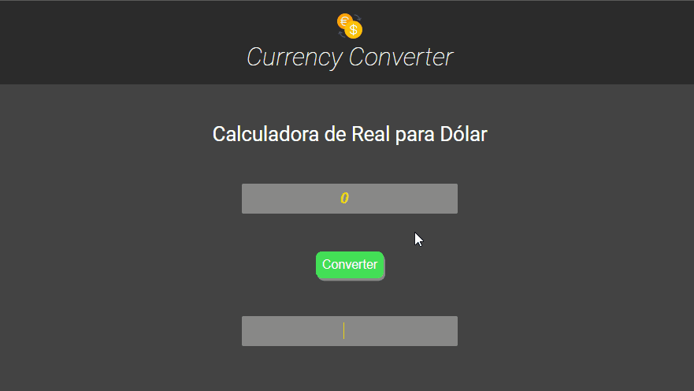

<h1 align="center">
  
</h1>

  <a href="#-tecnologias">Tecnologias</a>&nbsp;&nbsp;&nbsp;|&nbsp;&nbsp;&nbsp;
  <a href="#-projeto">Projeto</a>&nbsp;&nbsp;&nbsp;|&nbsp;&nbsp;&nbsp;

 

  

## 🚀 Tecnologias

Esse projeto está sendo desenvolvido com as seguintes tecnologias:

- HTML
- CSS
- JavaScript

 

## 💻 Projeto

O Currency Converter é uma aplicação para conversão de moedas, onde será possível selecionar diversas moedas utilizadas no mundo e converte-las para o real ou vice-versa utilizando uma API.

Atualmente apenas utilizar uma função com Javascript para converter de real para dólar.💰

---

Feito com ♥ by Banzak
